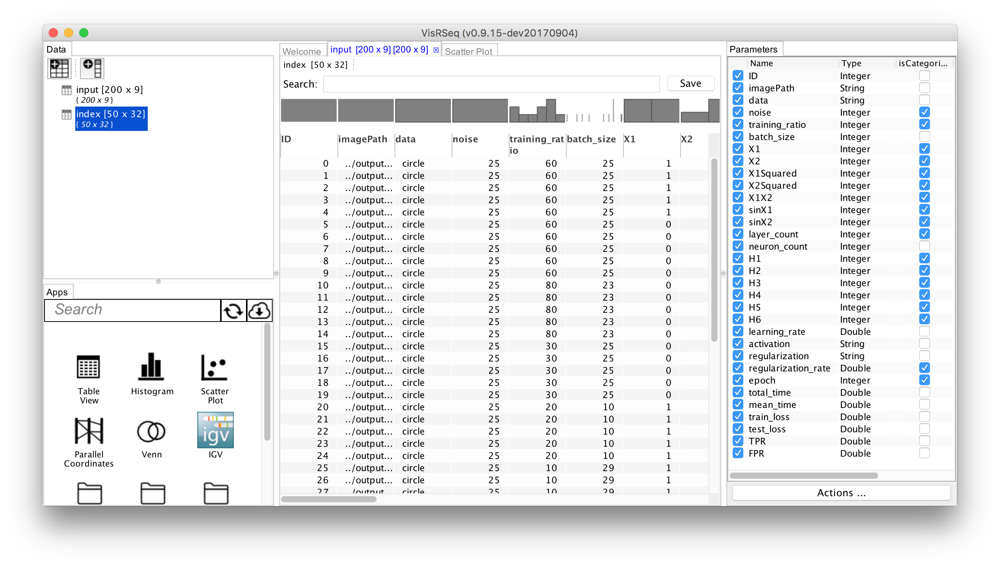

# Parameter Space Analysis of Neural Networks

Materials for the Visualization assignment for 2017 Czech-Austrian Summer School on "Deep Learning and Visual Data Analysis" 

## Introduction
You will be using / extending VisRseq for visual analysis of parameter space exploration of neural networks inspired on the [web-based tensorflow playground demo](http://playground.tensorflow.org/). If you have not used the online tool previously we encourage you to spend some time with the online tool and get yourself familiarized with different parameters that affect outcome of a neural network.
We have created the datasets using our own [python implementation](https://github.com/hyounesy/TFPlaygroundPSA) of the online demo. So, while we have tried to keep our implementation as close as possible to the online demo, you may find subtle differences between the outcomes of the two.

There are a total of five different dataset. For all datasets, we have created random configurations of the netural network by picking random values for each of the hyper parameters. For each neural network configuration, we ran the training and recorded statistics about the results at different epochs.
For one of the datasets (full), we have randomized all parameters, including the input data shape and noise. For each of the other four datasets (circle, xor, gauss, spiral), we kept the data shape and noise fixed,and randomized all the other parameters.

## Presentation Slides 
[Presentation slides](Slides/VisRseq_Slides.pdf)


## Software Requirements
Download the latest version of VisRseq from [visrseq.github.io](http://visrseq.github.io). Follow the installation requirements.

## Quick Tutorial
  * Download the small test data from [data/tiny](data/tiny)
  * Run VisRseq
  * Click on the toolbar button with the table icon (top left) and select [Open Table]
  * Open the data/tiny/circle_25/input.txt file
  * Open the data/tiny/circle_25/index.txt file
  * Drag-n-Drop the [Table View] or [Scatter Plot] app from the Apps pane (bottom left) to the workspace.
  * Drag-n-Drop either of the data tables from the data pane into the app window.
  * Change the app parameters using the Parameter pane (right)

  



### Using TableView app
<a href="https://www.youtube.com/embed/R80biKPSXSQ" target="_blank"></a>

### Using Parameter Explorer app
Note: The parameter explorer app cannot currently load tables much larger than 10,000 rows due to memory limitation. You may use it on circle_25, xor_25, gauss_25 or spiral_25 datasets, but the parameter explorer app will not work on the full dataset (100,000 rows).
<a href="https://www.youtube.com/embed/svh7LOX6eY4" target="_blank"></a>

## Datasets

 _ | data | Download Link | Example | Description
----|----|----|----|----|
 | full | [full.zip (3.2G)](https://drive.google.com/uc?id=0Bz2L2qpV9PICa0s1blY4bGVMNzg&export=download)| [tiny version (200 rows)](data/tiny/full) | random shapes and noises. 100,000 records
 | circle_25 | [circle_25.zip (330M)](https://drive.google.com/uc?id=0Bz2L2qpV9PICNmYxd0NhbW9PbnM&export=download)| [tiny version (50 rows)](data/tiny/circle_25) | circle with 25% noise. 10,000 records
 | gauss_25 | [gauss_25.zip (346M)](https://drive.google.com/uc?id=0Bz2L2qpV9PICOVpoTDNzc3NQNlU&export=download)| [tiny version (50 rows)](data/tiny/gauss_25) |  gauss with 25% noise. 10,000 records
 | xor_25 | [xor_25.zip (371M)](https://drive.google.com/uc?id=0Bz2L2qpV9PICZkR4YTFRWG5PY1E&export=download) | [tiny version (50 rows)](data/tiny/xor_25) |  xor with 25% noise. 10,000 records
 | spiral_25 | [spiral_25.zip (312 MB)](https://drive.google.com/uc?id=0Bz2L2qpV9PICRWtBYWY1VkFuZWs&export=download) | [tiny version (50 rows)](data/tiny/spiral_25) |  spiral with 25% noise. 10,000 records

Here are information about the data files:

### index.txt
This file contains the summarized stats for the parameter space analysis. Each row corresponds to one random combination of hyper parameter values at a particular epoch.

field | type | description
---- | ---- | ----
ID	| output: integer | row unique id
imagePath | output: string | output image path
data | input: string: {circle, gauss, xor, spiral} | dataset shape
noise | input: int: [0 .. 50] | data noise percent: 0 to 50
training_ratio | input: int: [10 .. 90]  | ratio of training to test data
batch_size | input: int: [1 .. 30] | training batch size
X1 | input: int: {0, 1} | 1 if X<sub>1</sub> feature is an input to the network, 0 otherwise
X2 | input: int: {0, 1} | 1 if X<sub>2</sub> feature is an input to the network, 0 otherwise
X1Squared | input: int: {0, 1} | 1 if X<sub>1</sub><sup>2</sup> feature is an input to the network, 0 otherwise
X2Squared | input: int: {0, 1} | 1 if X<sub>2</sub><sup>2</sup> feature is an input to the network, 0 otherwise
X1X2 | input: int: {0, 1} | 1 if X<sub>1</sub>X<sub>2</sub> feature is an input to the network, 0 otherwise
sinX1 | input: int: {0, 1} | 1 if sin(X<sub>1</sub>) feature is an input to the network, 0 otherwise
sinX2 | input: int: {0, 1} | 1 if sin(X<sub>2</sub>) feature is an input to the network, 0 otherwise
layer_count | input: int:[0 .. 6] | number of hidden layers 
neuron_count | input: int | sum of neurons in all hidden layers
H1 | input: int: [0 .. 8] | number of neurons in hidden layer 1
H2 | input: int: [0 .. 8] | number of neurons in hidden layer 2
H3 | input: int: [0 .. 8] | number of neurons in hidden layer 3
H4 | input: int: [0 .. 8] | number of neurons in hidden layer 4
H5 | input: int: [0 .. 8] | number of neurons in hidden layer 5
H6 | input: int: [0 .. 8] | number of neurons in hidden layer 6
learning_rate | input: float | learning rate
activation | input: string: {ReLU, Tanh, Sigmoid, Linear} | activation function for hidden layers
regularization | input: string: {None, L1, L2} | regularization type
regularization_rate | input: float | regularization rate
epoch | output: int: {25, 50, 100, 200, 400} | epoch for which the stats were generated
iteration | output: int | iteration (step) for which the stats were generated
total_time | output: float | total time (ms) at this epoch 
mean_time | output: float | mean time (ms) per epoch
train_loss | output: float | training loss
test_loss | output: float | test loss
train_TPR | output: float | True Positive Rate (rate of +1 points correctly classified) on training data
train_FPR | output: float | False Positive Rate (rate of -1 points incorrectly classified as +1) on training data
test_TPR | output: float | True Positive Rate (rate of +1 points correctly classified) on test data
test_FPR | output: float | False Positive Rate (rate of -1 points incorrectly classified as +1) on test data


## Assignment

There are two categories for this assignment: (1) Data Analysis, (2) App development / improvement. You may participate in either or both categories.

### (1) Data Analysis
You will be using VisRseq to create an [infographic](https://en.wikipedia.org/wiki/Infographic) or report about the datasets.
  * The submission will be in the form of a single page PDF document or PNG image. 
  * All plots in the infographic should be generated within the VisRseq framework, but you may use other software (e.g. MS Word, MS Powerpoint, Photoshop, etc.) to arrange several plots and to add additional text or graphics.
  * The submissions will be evaluated based on:
    * functionality / the amount of information content
    * clarity (i.e. ease of interpretation)
    * usability / interaction possibilities
    * interesting findings
Please describe your interesting/surprising findings in words as well by answering the following questions:
  
1. what did you learn about the relationship between the number and size of the hidden layers?
1. Which of the metaparameters were the most important and why?
1. Were some parameters only important for certain datasets? Which ones? Why?
1. What drove you to explore different parameters combinations in the tensorflow playground?
1. What were the limits of the data set? I.e. are there relationships that are inconclusive where a larger data set might have given you a better understanding?
1. What were the advantages and limits of the interface (VisRseq)?

For all questions: please support your answers with figures/images.


### (2) App Development / Improvement
For this category, you can choose to develop a new R-App or modify and improve an existing R-App. This can specially be interesting for those who would like a coding challenge and/or are familiar with R.
A detailed tutorial on how to create apps for VisRseq framework can be found [here](https://github.com/hyounesy/bioc2016.visrseq).
The goal is to enhance the current analytical power of VisRseq to allow getting more or improved results. App(s) may add new computational functionality (e.g. new classification method) or new plots. It is still in the context of the parameter space analysis datasets, but the app should be designed such that it can be used with any tabular data.

  * The submission should include the ```.R``` and ```.json``` files for the new or improved app. 
  * App(s) should be functional in the current VisRseq version.
  * The submission should also include a ```.pdf``` or ```.md``` document explaining the app functionality and example output.
  * If your app is selected to be included in the VisRseq framework, you will be credited in the credits section of the webpage.


## Submitting
All submissions are due by Thursday Sept 7th at 11:59pm czech time (CET). The results will be announced and discussed during the workshop session on Friday September 8 at 8:30am CET.

Please refer to the [submission instructions](submissions/README.md) for details.

## Questions and Issues
You may ask your questions in person from Thomas Torsney-Weir or use the [github issue page](https://github.com/hyounesy/cass2017_vis/issues).
