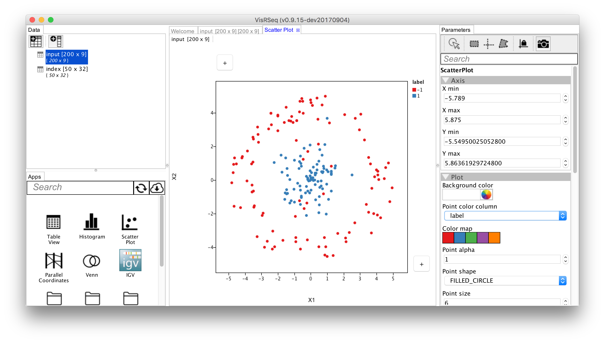

What did you learn about the relationship between the number and size of the hidden layers?

Answer

Which of the metaparameters were the most important and why?

Answer

Were some parameters only important for certain datasets? Which ones? Why?

Answer

What drove you to explore different parameters combinations in the tensorflow playground?

Answer

What were the limits of the data set? I.e. are there relationships that are inconclusive where a larger data set might have given you a better understanding?

Answer

What were the advantages and limits of the interface (VisRseq)?

Answer

